<div align="center">



# Larry Arnold | Cipher

### Founder of LA Builds

Building AI systems that help humanity think, learn, create, and thrive.

</div>

# SENTINEL PROTOCOL COMMAND CENTER

### Building AI systems that help humans think, create, learn, and thrive.

<br>


<br>


</div>

---

# COMMAND CENTER

```text
╔══════════════════════════════════════════════════╗
║             SENTINEL PROTOCOL // ONLINE                   ║
╠══════════════════════════════════════════════════╣
║ OPERATOR ............... CIPHER                           ║
║ ORGANIZATION ........... LA BUILDS                        ║
║ AI RESEARCH ............ ACTIVE                           ║
║ PROJECTS ............... DEPLOYING                        ║
║ HUMAN AUGMENTATION ..... IN PROGRESS                      ║
║ COFFEE RESERVES ........ CRITICALLY LOW                   ║
║ DETERMINATION .......... LEGENDARY                        ║
╚══════════════════════════════════════════════════╝
```

---

# MISSION

Technology should reduce cognitive load, amplify human capability, and help people focus on what truly matters.

My work focuses on:

- Artificial Intelligence
- Agentic Systems
- AI Safety
- Human Cognition
- Knowledge Systems
- Cognitive Augmentation
- Full Stack Engineering
- Human-Centered Technology

---

# SENTINEL ECOSYSTEM

<table>
<tr>
<td width="50%">

## CaptureFlow

AI-powered cognitive offload system.

Capture information instantly and transform it into structured knowledge.

</td>

<td width="50%">

## Red Set ProtoCell

AI immune system and autonomous red-team framework designed for AI safety.

</td>
</tr>

<tr>
<td width="50%">

## AI Control Plane

Unified command layer for orchestrating AI systems and workflows.

</td>

<td width="50%">

## ARES Dashboard

Telemetry, orchestration, and visibility platform for complex AI operations.

</td>
</tr>
</table>

---

# TECHNOLOGY STACK

### Languages


### Frontend


### Backend


### Infrastructure


---

# CURRENT OBJECTIVES

- Build CaptureFlow into a world-class cognitive assistant
- Advance AI safety through Red Set ProtoCell
- Expand the Sentinel Protocol ecosystem
- Research scalable agent architectures
- Create technology that genuinely helps people

---

# LIVE TELEMETRY

<div align="center">
  
  
  
  
  
</div>

---

# ACTIVITY STREAM

<div align="center">


</div>

---

# RESEARCH INTERESTS

```text
Artificial Intelligence
Agentic Systems
AI Safety
Human Cognition
Neuroscience
Physics
Consciousness
Knowledge Systems
Complex Adaptive Systems
Human-AI Collaboration
```

---

# PHILOSOPHY

> Build tools that make people stronger, not dependent.
>
> Build systems that amplify thinking, not replace it.
>
> Build technology that matters.

---

# CONNECT

GitHub:
https://github.com/Arnoldlarry15

LinkedIn:
https://linkedin.com/in/larry-arnold

Email:
labuilds@proton.me

---

<div align="center">

### SENTINEL PROTOCOL

"Building the future, one system at a time."

</div>
